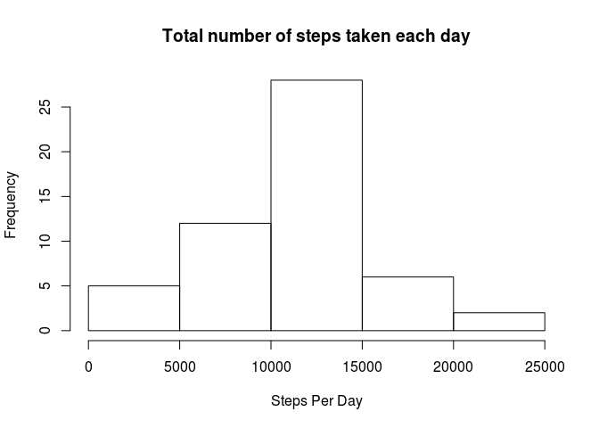
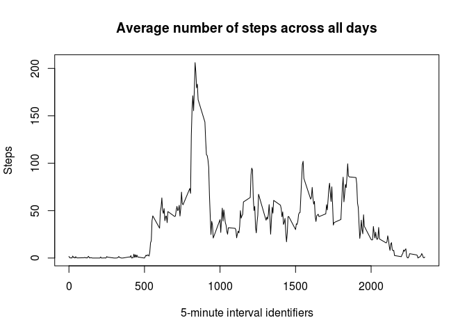
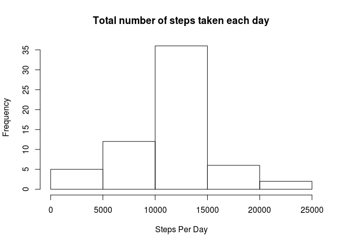

# Reproducible Research: Peer Assessment 1


## Loading and preprocessing the data

Assuming the `activity.csv` is in your working directory, you can load data.


```r
data <- read.csv("activity.csv", header=TRUE, sep=",", na.strings="NA")
```


## What is mean total number of steps taken per day?

Lets first clean the dataset of `NA` values :


```r
data.clean <- data[!is.na(data$steps),]
```

Now, lets create the histogram of total number of steps per day:


```r
steps.aggregate <- aggregate(steps~date, data.clean, sum)

hist(steps.aggregate$steps, main="Total number of steps taken each day", xlab="Steps Per Day")
```

 


We can also calculate mean and median number of steps per day:


```r
steps.mean <- mean(steps.aggregate$steps)
steps.median <- median(steps.aggregate$steps)
```

* Mean = 1.0766189\times 10^{4}
* Median = 10765

## What is the average daily activity pattern?

Lets have a look at the average daily activity patern :


```r
steps.avg <- aggregate(steps~interval, data.clean, mean)

plot(steps.avg$interval, steps.avg$step, type="l",xlab="5-minute interval identifiers", ylab="Steps", main="Average number of steps across all days")
```

 


```r
max.idx <- which.max(steps.avg$steps)
max.interval <- steps.avg[max.idx, 'interval']
max.avgStep <- steps.avg[max.idx, 'steps']
```

On average across all the days in the dataset, 835 5-minute interval contains maximum number of steps (206.1698113 steps)

## Imputing missing values


```r
na.nb <- sum(is.na(data$steps))
```

We have 2304 missing values in the dataset.

Lets fill the missing values with the mean of that 5-minute interval


```r
na.idx <- which(is.na(data$steps))
na.inter <- data[na.idx, 3]
na.fill <- sapply(na.inter, function(x){steps.avg[(steps.avg$interval==x), 2]})
```

Now we can create a new dataset without `NA` values


```r
data.new <- data
data.new[na.idx, 'steps'] = na.fill
```

We can recalculate the average of steps and plot the corresponding histogram 


```r
steps.newAggregate <- aggregate(steps~date, data.new, sum)

hist(steps.newAggregate$steps, main="Total number of steps taken each day", xlab="Steps Per Day")
```

 

We can also re-calculate mean and median number of steps per day:


```r
steps.newMean <- mean(steps.newAggregate$steps)
steps.newMedian <- median(steps.newAggregate$steps)
```

* Mean = 1.0766189\times 10^{4}
* Median = 1.0766189\times 10^{4}

As we can see, mean didn't changed but median did. The median is now equal to the mean. By using the average value of the interval to fill `NA` values, we removed the unbalance caused by `NA` values.

## Are there differences in activity patterns between weekdays and weekends?
